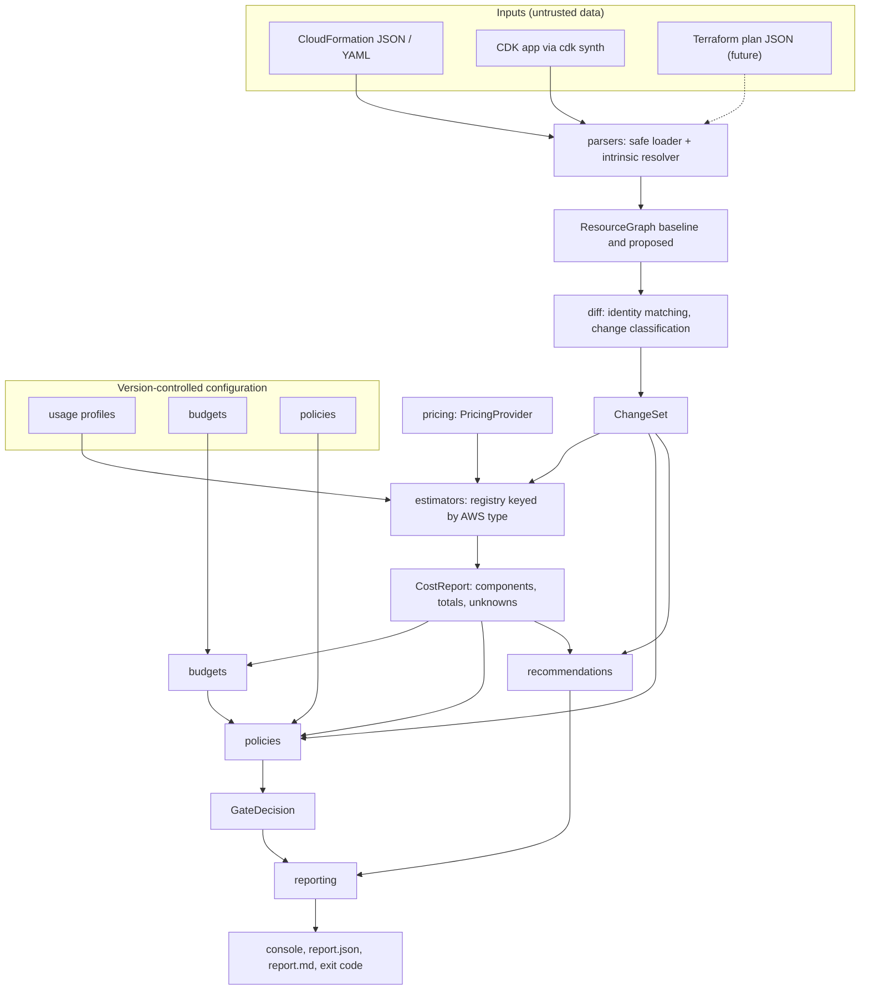
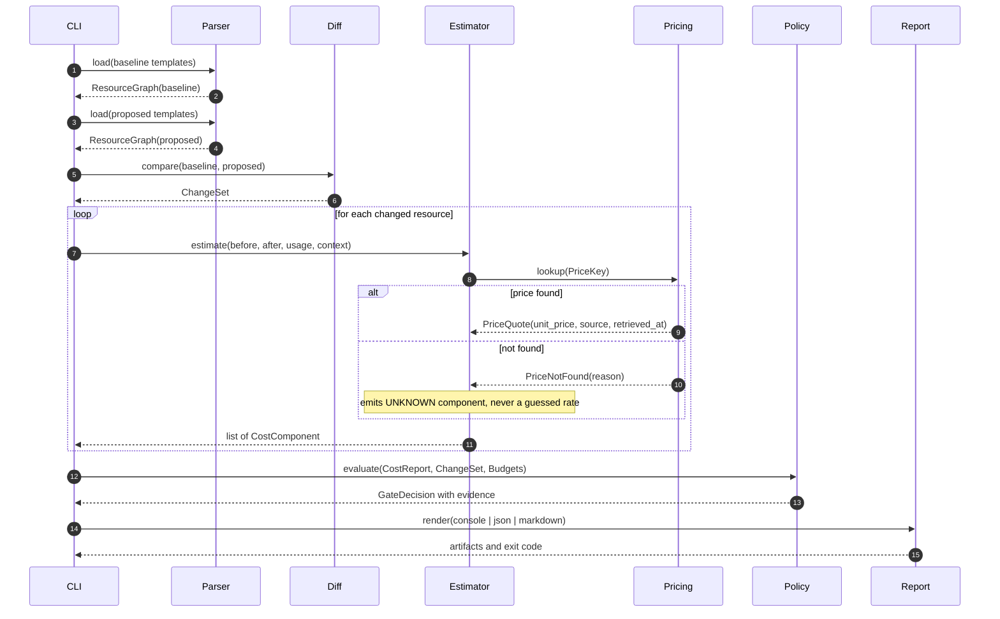
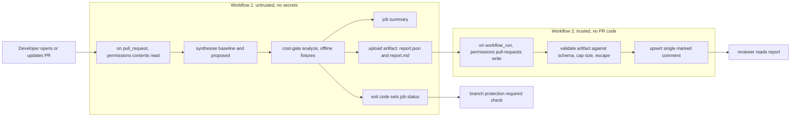
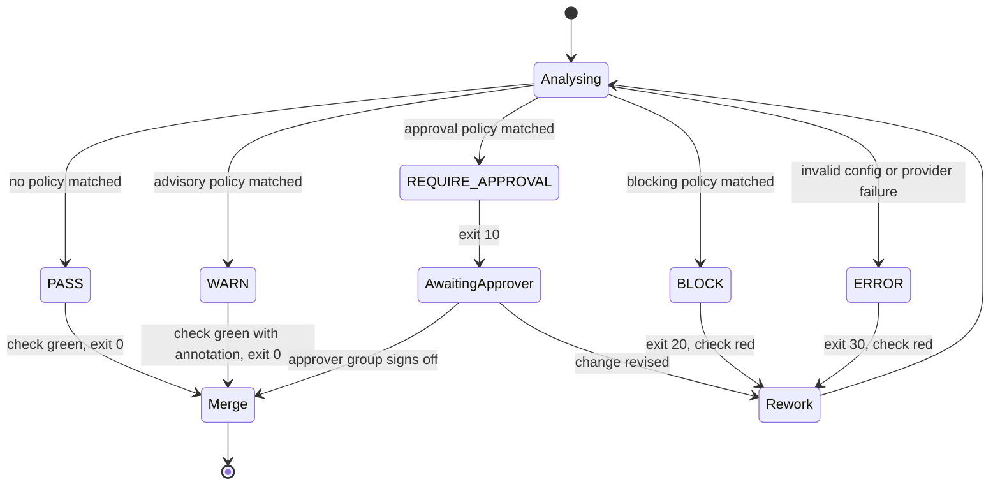
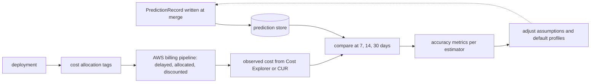

# Architecture

## 1. What this system is

The cost-aware deployment gate is a **command-line program** that answers one question in a
pull request:

> If we merge this infrastructure change, what happens to the monthly AWS bill, and is that
> acceptable under the rules this organisation has agreed to?

It is not an agent, not a service, and not a dashboard. It reads two Infrastructure-as-Code
snapshots, produces a decision and three renderings of a report, and exits with a status code.
Everything else — GitHub Actions, approvals, artifacts — is orchestration around that core.

## 2. Design principles

| # | Principle | Consequence in the code |
|---|---|---|
| P1 | **Unknown is not zero.** | `CostComponent.monthly_cost` is `Money \| None`. Totals carry a separate unknown count. No code path substitutes `0` for an unresolved input. |
| P2 | **Estimate states, derive deltas.** | Estimators price the *before* state and the *after* state under one pricing snapshot and one usage profile. `delta = proposed − current`, so report reconciliation is structural, not aspirational. |
| P3 | **Explain every number.** | Each component carries assumptions with provenance, confidence with reasons, and a pricing-source reference. A reviewer can always ask where a number came from and get the answer from the artifact alone. |
| P4 | **The domain knows nothing about the outside world.** | `cost_gate.domain` imports no `boto3`, no `typer`, no `requests`, no GitHub. Every external system sits behind an adapter. |
| P5 | **Determinism is a feature.** | Same inputs produce a byte-identical report. Time and run IDs come from an injected `Clock`. Ordering is total, never dependent on dict iteration or filesystem order. |
| P6 | **Untrusted input is untrusted everywhere.** | Templates are data, not code. Policies are data, not code. PR artifacts are data, not code. Each boundary validates and escapes. |
| P7 | **Offline by default.** | The default execution path needs no AWS credentials and no network. Privileged paths are separate, opt-in, and documented. |

## 3. Component architecture

### Package responsibilities

| Package | Responsibility | May import |
|---|---|---|
| `domain/` | Value objects and enumerations: money, resources, changes, cost components, decisions. Pure data plus invariants. | stdlib, pydantic |
| `config/` | Loading and validating user configuration (usage, budgets, policies, root config). Emits precise error paths. | domain |
| `parsers/` | Template text to `ResourceGraph`. Safe YAML/JSON loading, intrinsic-function resolution, normalisation. | domain |
| `diff/` | Two graphs to a `ChangeSet`. Identity matching and change classification. | domain |
| `pricing/` | The `PricingProvider` protocol and its implementations (fixture catalog, cache, chain). | domain |
| `estimators/` | Resource state to cost components. One module per AWS service family, registered by type. | domain, pricing |
| `budgets/` | Budget scope matching and evaluation. | domain |
| `policies/` | Predicate evaluation and decision precedence. | domain |
| `recommendations/` | Evidence-linked FinOps suggestions. | domain |
| `reporting/` | Console, JSON and Markdown renderers; reconciliation checks; escaping. | domain |
| `adapters/` | Everything touching the outside world: boto3 pricing, git, CDK subprocess, GitHub, filesystem, clock. | anything |
| `cli/` | Typer commands. Wiring only, no business logic. | everything |
| `observability/` | Structured logging, run IDs, counters. | stdlib |

The dependency rule is one-directional and is enforced by an import-linter check in CI:
nothing in `domain/`, `diff/`, `estimators/` or `policies/` may import `adapters/` or `cli/`.

## 4. The analysis pipeline

## 5. Pull-request flow

The split exists because the two halves need opposite trust levels. Workflow 1 executes code
from the pull request (`cdk synth` runs `app.py`), so it must never hold a write token or AWS
credentials. Workflow 2 holds a write token, so it must never execute pull-request code — it
only consumes a schema-validated artifact. See [security.md](security.md) and
[ADR 0007](adr/0007-github-workflow-privilege-separation.md).

## 6. Approval flow

Deployment jobs — where they exist at all — are gated on the recorded decision, not on a
re-run of the analysis, so the artifact a human reviewed is the artifact that authorises the
deployment.

## 7. Actual-cost feedback loop (later phase)

Every arrow into the billing pipeline degrades attribution quality: delay, shared costs,
discounts, credits, taxes, Savings Plans amortisation, and tag-activation lag. The feedback
loop is therefore a *bias detector for estimators*, not a scoring system for individual
deployments. See `actual-cost-feedback.md`, written in Phase 17.

## 8. Trust boundaries

| Boundary | Input | Treated as | Control |
|---|---|---|---|
| Template load | CloudFormation from a PR | Untrusted data | Safe YAML loader, size/depth/node limits, path confinement |
| CDK synth | `app.py` from a PR | **Untrusted code** | Runs only in the unprivileged workflow; no secrets in that job |
| Config load | Policies, budgets, usage | Semi-trusted data | Closed schema, `extra="forbid"`, no code execution |
| Report to comment | `report.json` artifact | Untrusted data | Schema validation, size cap, Markdown escaping |
| Pricing refresh | AWS Price List API | Trusted service, untrusted volume | Pagination limits, throttle backoff, checksum lock on output |

## 9. What this architecture deliberately excludes

* **No web service, database, or long-running AWS resource.** The tool runs for seconds inside
  a CI job and exits. Optional AWS infrastructure (Phase 16) is scale-to-zero and is never
  deployed by default.
* **No plugin system that executes user code.** Extensibility means registered estimators
  inside the package, not arbitrary modules named in configuration.
* **No attempt to reproduce the AWS bill.** The tool estimates the cost of resources *described
  by a template*. That is a strict subset of an account's spend, and the reports say so.
