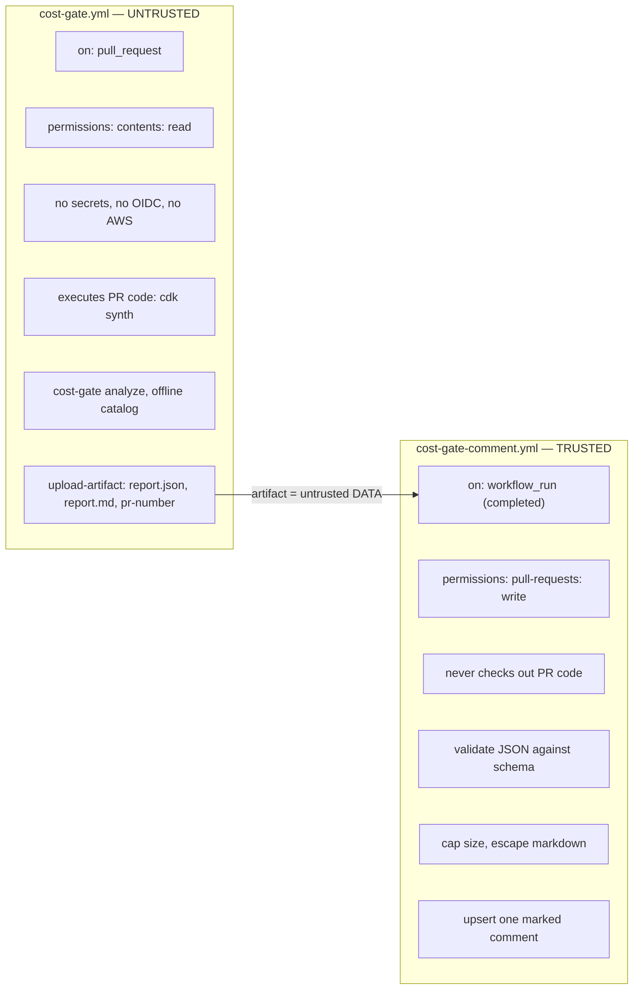

# Security model

## 1. Threat model in one paragraph

This tool runs inside CI, reads files that anyone who can open a pull request controls, and
sits next to credentials that can read AWS pricing data and — in optional workflows — deploy
infrastructure. The central risk is therefore not a clever exploit in the estimator; it is the
ordinary CI failure mode where **attacker-controlled content ends up in a job that holds a
token**. Everything below follows from designing against that.

## 2. The GitHub Actions trigger problem

This is the single most important security decision in the project, so it is worth stating
precisely.

| Trigger | Runs code from | Token | Secrets on forks |
|---|---|---|---|
| `pull_request` | The pull request head | Read-only for forks | Not available |
| `pull_request_target` | **The base branch**, but usually checked out as head by mistake | Read/write | **Available** |
| `workflow_run` | The base branch | Read/write | Available |

`pull_request_target` exists so that workflows can comment on fork pull requests. It runs with
a **write token and access to secrets**, in the context of the base branch. The catastrophic
and extremely common misuse is:

```yaml
# NEVER DO THIS
on: pull_request_target
jobs:
  build:
    steps:
      - uses: actions/checkout@v4
        with:
          ref: ${{ github.event.pull_request.head.sha }}   # attacker-controlled code
      - run: npm ci && npx cdk synth                       # ...executed with a write token
```

Any fork can then run arbitrary code with repository write access and exfiltrate every secret.
For this project the risk is acute because **`cdk synth` is arbitrary code execution by
design** — it imports and runs `app.py` from the pull request.

**Rule for this repository: `pull_request_target` is not used. Anywhere.** A CI check enforces
this by grepping the workflow directory.

## 3. Privilege separation

Two workflows, opposite trust levels, connected only by a data artifact.



The artifact crossing the boundary is treated as hostile input: it is schema-validated, size-
capped, and escaped before a single byte reaches a comment body. A pull request author can
influence the *content* of the report (their template supplies logical IDs and tag values), so
the report is not trusted merely because our own tool produced it.

The PR number is read from the artifact and cross-checked against the `workflow_run` payload,
so a crafted artifact cannot redirect a comment to a different pull request.

## 4. AWS access

* **No long-lived AWS keys.** Where AWS access is needed, workflows use GitHub OIDC to assume a
  role with a trust policy scoped to this repository and a specific ref or environment.
* **No AWS access on the pull-request path.** The default analysis is fully offline; there is
  nothing for an attacker to steal in the job that runs their code.
* **Least privilege for pricing refresh**: `pricing:GetProducts`, `pricing:DescribeServices`,
  `pricing:GetAttributeValues`. These read a public catalog and expose no account data.
* **Deployment workflows** (optional, Phase 15/16) run only from a protected environment with
  required reviewers, never on `push` or `pull_request`.

An OIDC trust policy must pin both the audience and the subject; a wildcard subject would let
any repository assume the role:

```json
{
  "Condition": {
    "StringEquals": {
      "token.actions.githubusercontent.com:aud": "sts.amazonaws.com",
      "token.actions.githubusercontent.com:sub": "repo:OWNER/REPO:environment:pricing-refresh"
    }
  }
}
```

## 5. Input handling

| Input | Risk | Control |
|---|---|---|
| YAML template | Deserialisation to arbitrary objects | Custom subclass of `yaml.SafeLoader` only; `FullLoader`/`UnsafeLoader`/`yaml.load` without a loader are banned and CI-grepped |
| YAML template | Billion-laughs / alias expansion DoS | Node-count, depth and file-size caps enforced during parse |
| Template file paths | Path traversal via includes or CLI args | Paths resolved and confined to an explicit root; symlinks rejected |
| Logical IDs, tags, parameter values | Markdown/HTML injection into a PR comment | Central escaper: neutralises backticks, pipes, angle brackets, `@` mentions, control characters; truncates to a length cap |
| Logical IDs, file names | Command injection | No shell interpolation anywhere; subprocess calls use argument lists, never `shell=True` |
| Policy files | Arbitrary code execution | Closed predicate grammar; no `eval`, no expression language, no dynamic imports |
| Report artifact | Comment spoofing / oversized body | Schema validation, size cap, PR-number cross-check |
| Pricing catalog | Silent tampering | sha256 lock file, `cost-gate pricing verify` |

## 6. Secrets and sensitive data

* No AWS account IDs, ARNs, access keys, or real customer identifiers in fixtures, examples or
  tests. Fixture account IDs use the reserved-looking placeholder `000000000000`.
* Structured logs redact values that look like credentials and never log full tag maps, which
  frequently contain owner emails and internal project codes.
* Cost figures can themselves be sensitive. The Markdown reporter supports a reduced mode that
  omits absolute totals and reports only deltas and the decision, for repositories where
  aggregate spend should not be visible to every contributor.
* Artifacts have an explicit short retention period rather than the default.

## 7. Supply chain

* Third-party GitHub Actions are **pinned to a full commit SHA**, with the version in a
  trailing comment. Tags are mutable; SHAs are not.
* Python dependencies are declared with lower and upper bounds and audited with `pip-audit` in
  CI.
* Static analysis with Bandit; linting with Ruff including the `S` (bandit) rule set.
* No `curl | bash` installs. Any downloaded tool must have a pinned version and a checksum.
* Dependabot is configured for Actions and Python, with grouped updates so that a review is
  meaningful rather than routine.

## 8. Permissions defaults

Every workflow sets `permissions:` explicitly at the top level, starting from nothing and
adding only what a job needs:

```yaml
permissions: {}          # workflow default: nothing
jobs:
  analyze:
    permissions:
      contents: read     # the minimum to check out
```

`GITHUB_TOKEN` write scopes are never granted to a job that executes pull-request code.

## 9. What this project does not defend against

Stated explicitly, because a security document that claims completeness is not credible:

* **A malicious maintainer.** Anyone who can merge to the default branch can change workflows,
  policies and the pricing catalog. Branch protection and required reviews are the control, and
  they live outside this repository.
* **A compromised GitHub Actions runner or the Actions platform itself.**
* **Cost-based denial of wallet** through resources created outside this repository's IaC.
* **Correctness of the pricing catalog.** A wrong rate produces a wrong decision. The checksum
  lock detects tampering, not inaccuracy; the refresh pull request exists so a human reviews
  price movements.
* **Policy bypass by editing policies in the same pull request.** Mitigation is a `CODEOWNERS`
  entry on `policies/` requiring FinOps review — configured by the adopting organisation, and
  documented in `operations.md`.

## 10. Reporting a vulnerability

See `SECURITY.md` at the repository root.
